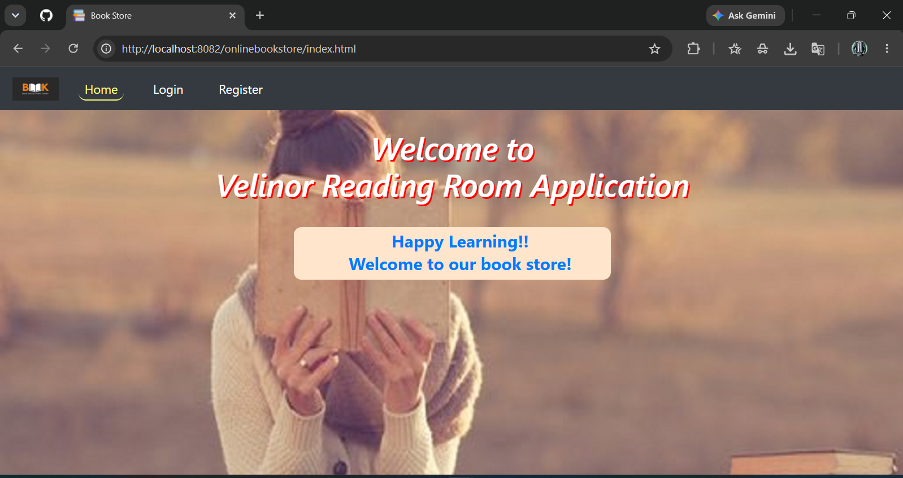
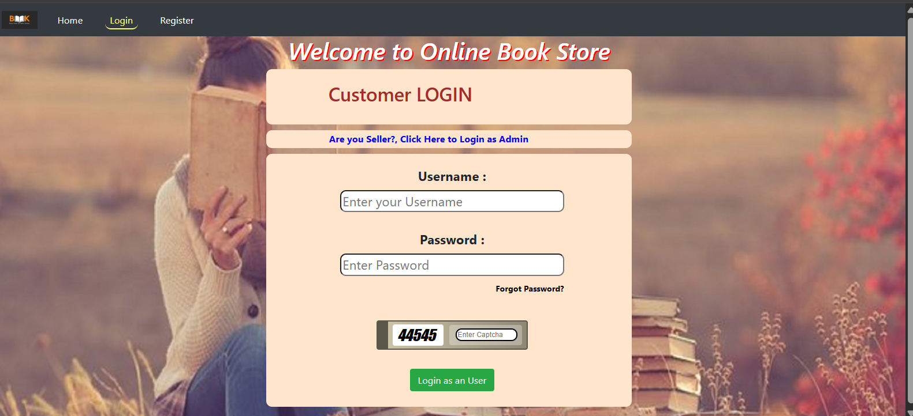
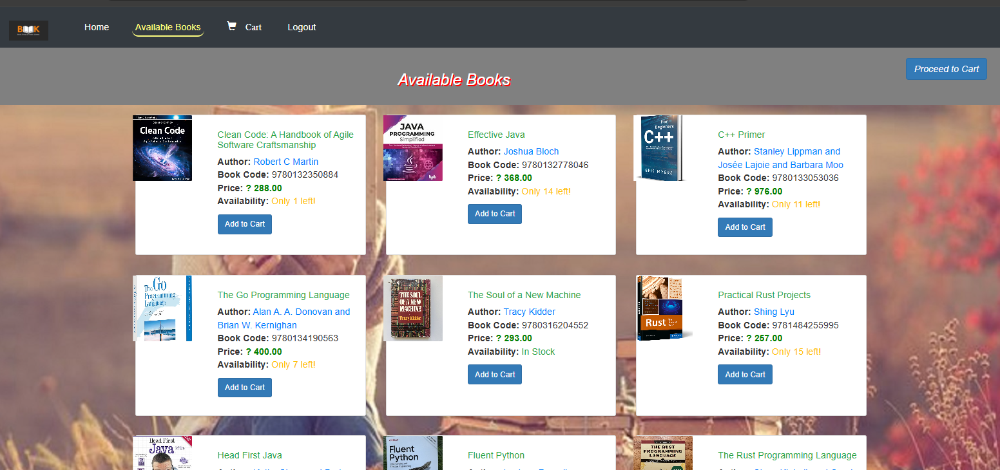
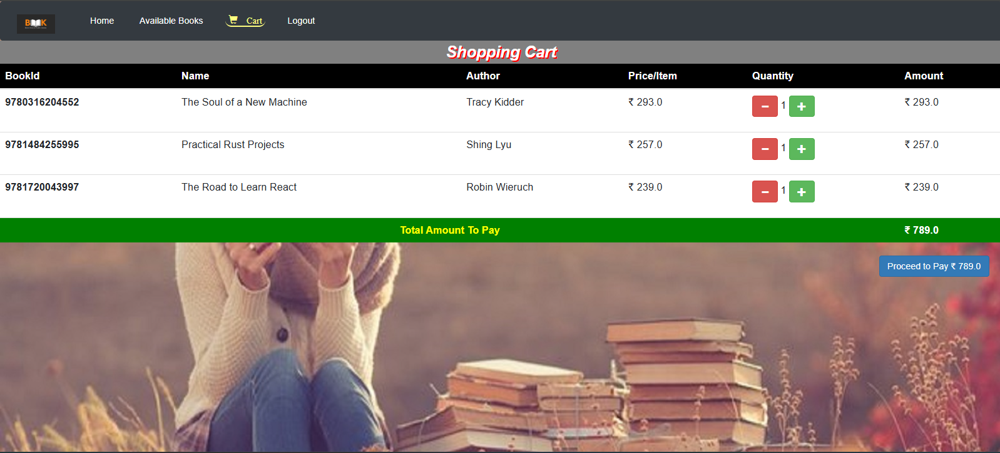
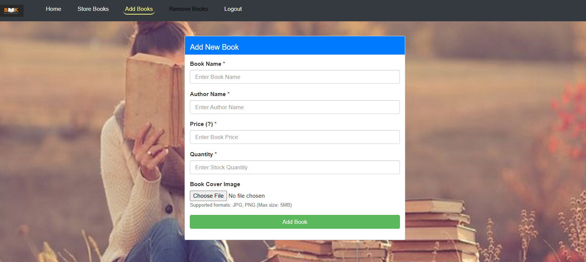
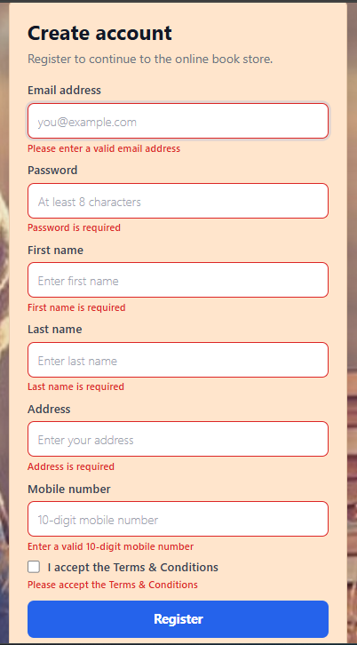

# Online Bookstore

Online Bookstore Management System using Java Servlets, HTML, CSS, JavaScript, Bootstrap, MySQL, JDBC, Validation, OTP Password Reset and Responsive UI.

## Features

- Customer Registration
- Customer Login
- Admin/Seller Login
- View Available Books
- Add Books to Cart
- Update Book Quantity in Cart
- Remove Books from Cart
- Checkout and Payment
- Payment Receipt
- Forgot Password with OTP Verification
- Reset Password
- Add Book
- Update Book
- Remove Book
- Upload Book Cover Image
- Form Validation
- Responsive Registration UI

---

## Tech Stack

### Backend
- Java
- Java Servlets
- JDBC
- MySQL
- JavaMail API

### Frontend
- HTML
- CSS
- JavaScript
- Bootstrap

### Tools
- Git
- GitHub
- Maven
- VS Code
- Eclipse IDE
- MySQL Workbench

---

## Project Structure

Backend
```text
servlets
service
service/impl
model
util
constant
```

Frontend
```text
WebContent
CustomerLogin.html
CustomerRegister.html
SellerLogin.html
CustomerHome.html
SellerHome.html
styles.css
user-validation.js
```

Database
```text
setup/CreateDatastore.sql
src/main/resources/application.properties
```

---

## Servlet Routes

| Route | Description |
|-------|-------------|
| /userreg | Register customer |
| /userlog | Customer login |
| /adminlog | Admin/Seller login |
| /viewbook | View available books |
| /cart | Manage cart |
| /checkout | Checkout books |
| /pay | Process payment |
| /buys | Generate receipt |
| /addbook | Add new book |
| /updatebook | Update book |
| /removebook | Remove book |
| /sendOtp | Send password reset OTP |
| /verifyOtp | Verify OTP |
| /resetPassword | Reset password |
| /logout | Logout |

---

## Screenshots

## Home Page



---

## Customer Login



---

## Customer Registration


---

## Available Books



---

## Cart Page



---

## Admin Dashboard


---

## Add Book



---

## Form Validation



---

## Future Enhancements

- Password Encryption
- Search Books
- Book Category Filter
- Order History
- Online Payment Gateway Integration
- Docker Support
- Cloud Deployment

---

## Author

**Jyoti Prakash Mandal**
